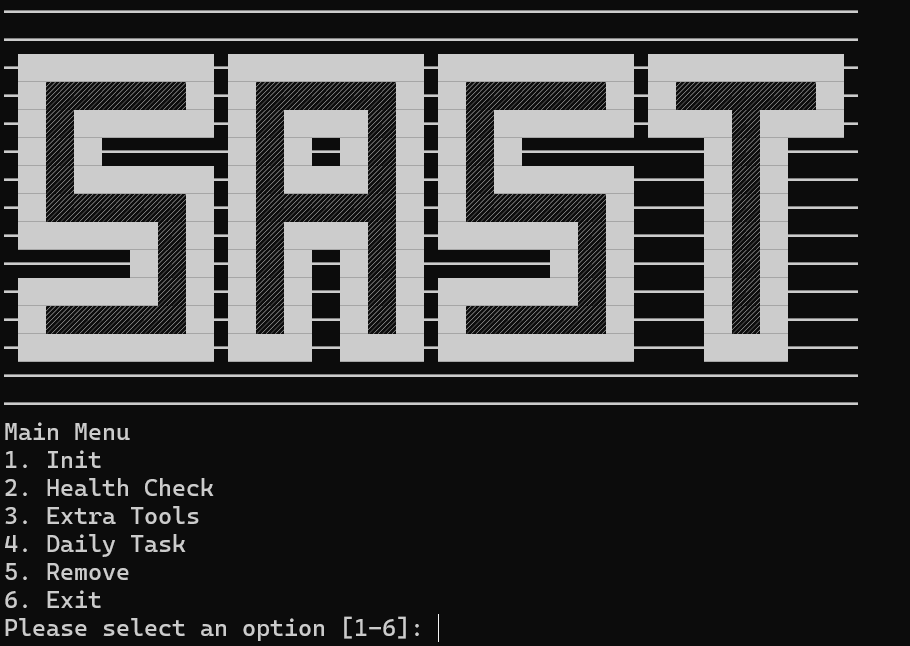
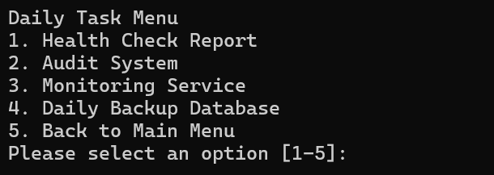
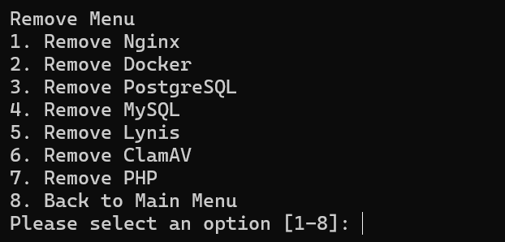
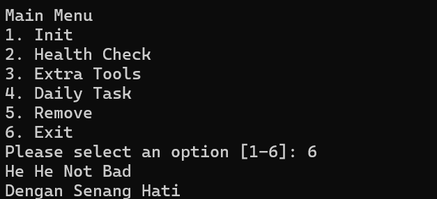

# SAST (Simple Automation Sysadmin Tools)

```bash
─────────────────────────────────────────────────────────────
─██████████████─██████████████─██████████████─██████████████─
─██░░░░░░░░░░██─██░░░░░░░░░░██─██░░░░░░░░░░██─██░░░░░░░░░░██─
─██░░██████████─██░░██████░░██─██░░██████████─██████░░██████─
─██░░██─────────██░░██──██░░██─██░░██─────────────██░░██─────
─██░░██████████─██░░██████░░██─██░░██████████─────██░░██─────
─██░░░░░░░░░░██─██░░░░░░░░░░██─██░░░░░░░░░░██─────██░░██─────
─██████████░░██─██░░██████░░██─██████████░░██─────██░░██─────
─────────██░░██─██░░██──██░░██─────────██░░██─────██░░██─────
─██████████░░██─██░░██──██░░██─██████████░░██─────██░░██─────
─██░░░░░░░░░░██─██░░██──██░░██─██░░░░░░░░░░██─────██░░██─────
─██████████████─██████──██████─██████████████─────██████─────
─────────────────────────────────────────────────────────────
```

Using bash script to automate daily working sysadmin (init installation, (healthcheck, monitoring, backup (cpu, memory, ram) vm, source code, services and database))

# Task
- manage user
- uptime
- monitoring (cpu, memory, disk)
- monitoring service (database, nginx, dll)
- file integrity checker
- backup (konfiguration, source code, database)
- alert
- log
- audit
- security
- hardening (ssh,firewall)

# Requirement
- bash
- ubuntu os

# Feature

## Main Menu



### Init


### Health Check


### Daily Task



### Remove




### Extra Tools


### Exit

